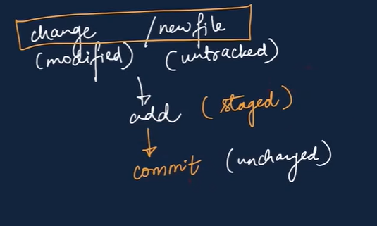

<h1>Learning Github</h1>
<h4>Author-Haroon Ijaz</h4>

<h2> Cloning a Repository: </h2>
<h6>Syntax:</h6>

 git clone link

<h6>Example:</h6>

git clone https://github.com/HaroonIjaz123/Apna-College-Demo.git

<h2> Git Status: </h2>

Gives State of the Code 

<h6>Example:</h6>

git status

<h6>Types of Status:</h6>

<b>Untracked:</b>New files that git doesn't yet track

<b>Modified:</b>changes in file

<b>UnModified:</b>Unchanged file

<b>Staged:</b>File is ready to be committed. <figcaption>Figure 1: Files staged and ready to commit</figcaption>

<h2> Add Command </h2>

Used to add new or modified files in current working directory to the Git staging area. 

<h6>Syntax:</h6>

git add fileName.extension

Note: This adds only single file
 

<b> To add all files for staging use the following syntax:
 

git add . 

<h2> Commit Command </h2>

Keeps record of changes. 

<h6>Syntax:</h6>

git commit -m "Any Message"

<h6>Example:</h6>

git commit -m "New folder 'Images' added and 'README.md' is modified"
 

Note: This only commits  on local machine.
 

<h2> Push Command </h2>

Uploades Local Repo cotent to the Remote Repo. 

<h6>Syntax:</h6>

git push origin main

 

In the command git push origin main, origin refers to the remote GitHub repository where your project is stored, and main is the branch you are working on. This command sends the changes from your local main branch to the remote repository on GitHub so that your latest commits become available online.
 

